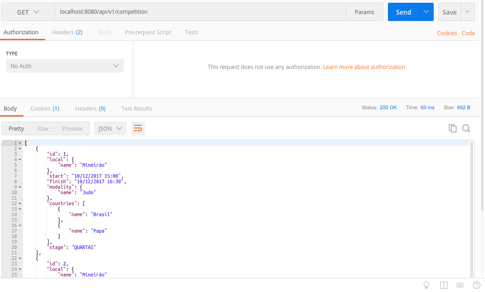
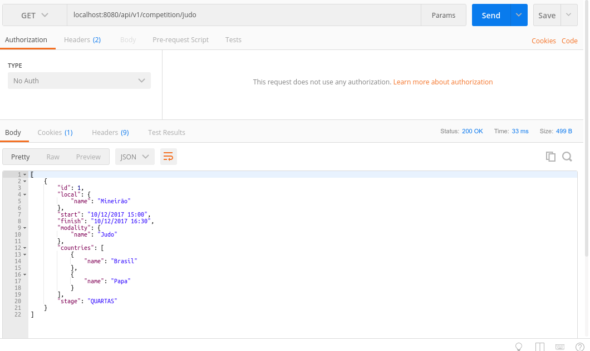

# Awesome README [](https://github.com/sindresorhus/awesome)
> O melhor README(ou tentativa) que você ira ver hoje.

Tokyo: Desafio criado para o processo seletivo da CI&T

## Getting Started

Esse projeto se propõe a criar uma API RESTful, para gerir dados das competições dos
Jogos Olímpicos Tokyo 2020. Serão dois endpoint's, um para cadastro das competições bem como suas regras de validaçes e outro para listagem dos cadastros.


### Prerequisites

Projeto Desenvolvido em Java 1.8 usando Springboot.

Deve-se a escolha do Springboot como starter e varios modulos para falicitar aconfiguração do projeto, os modulos usados neste projeto são:

```
Web - Full-Stack para desenvolvimento do spring MVC incluindo o tomcat.
JPA - Pera a persistencia dos dados incluindo spring-data e hibernate.
H2 -Banco de dados em memoria.
Spring-security - Usado para a segurança na exposição dos endpoints.
JWT- Usado para autenticação nos endpoints.
Swagger2 - Para criação do swagger para documentação dos endpoints.
```
Durante todo o processo de desenvolvido foi se atento para que seja limpo e organizado seguindo os princípios SOLID.

### Usage

Para utilizar o cadastro e listagem de competiçes e necessario um token  com o prefixo Bearer.
Para conseguir e simples basta fazer um requisição POST para

```
localhost:8080/api/login
```
Com o body da requisa em formato JSON

```javascript
{ 
  "username": "admin",
  "password": "password"
}
```

<br>
Obs: O método "static void addAuthentication()" gera um novo TOKEN cada vez que a aplicação é iniciada. Isso porquê valores estáticos são inicializados quando uma classe é criada. Dessa forma, um token JWT só é válido enquanto a aplicação não é reiniciada!

No header da resposta dessa requisição temos nosso token,agora para utilizar os endpoint's, agora precisamos enviar no header da requisição nosso token incluindo o cabeçalho Authorization com o JWT que recebemos quando realizamos a autenticação com sucesso.


<br>
Para o cadastro da competição alem do nosso amado token, tambem devemos fazer um requisão POST no endpoint

```
localhost:8080/api/v1/competition
```

Onde o body passado sera

```javascript

{
	"start": "10/12/2017 15:00",
	"finish" : "10/12/2017 16:30",
	"stage" : "quartas de final",
	"modality" : "Futebol",
	"local" : "Mineirão",
	"countries" : [
   		{
   			"name": "Brasil"
   		},
   		{
   			"name": "Alemanha"
   		} 		
   	]
}

```
Todas as regras e validaçes serão aplicadas, tais como uma execão foi criada "CompetitonException",que gere todo esse cliclo.
Também vale ressaltar que so e criado um novo Pais,Local ou competição caso ele não tenha sido cadastrado anteriormente.

Abaixo um exemplo de retorno,caso tenha sucesso.


<br>
A regra e a mesma para a listagem das competições, basta fazer um requisão GET passando o token no header para

```
localhost:8080/api/v1/competition
```

Caso queira fazer um filtro por Modalidade,basta passar o nome no parametro conforme exemplo abaixo.

```
localhost:8080/api/v1/competition/futebol
```


<br>

<br>
### Documentação

Foi adicionado um swagger mapeando as rotas disponiveis, ele esta acessivel em: 
Queria ter melhorado um pouco mais o codigo e implementado 

```
http://localhost:8080/swagger-ui.html
```


<br><br>
### Observaçes

Não implementei 100% do que queria e como queria por questes de tempo,conversei com a Fabiana sobre isto.
Queria cobrir com mais testes,organizar melhor o codigo e implementar outras funcionalidades.
Adotei a solução que e mais comum e agradavel que me senti mais a vontade para desenvolver.
Toda critica e sempre bem vinda.
Obs:Obs: Não sei pq os prints ficaram tão grandes!
